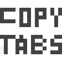
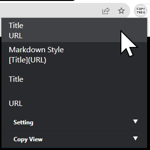
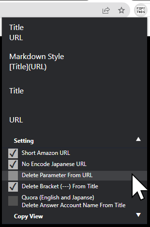
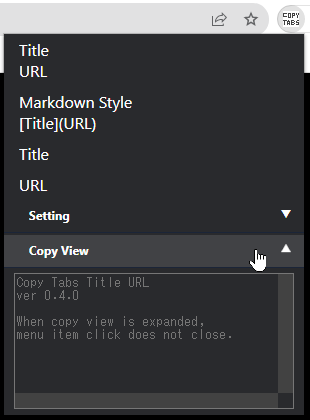

# Chrome Extention: Copy Tabs Title Url

## Chrome Web Store

Copy Tabs Title URL - Chrome Web Store  
https://chrome.google.com/webstore/detail/copy-tabs-title-url/lcfoefigmljgmbolbodknedngjcgelng

## GitHub

standard-software/chrome-copy-tabs-title-url  
https://github.com/standard-software/chrome-copy-tabs-title-url

## Screenshot

menu expand  

menu collapse Copy View  

menu collapse Setting  

## Feature

Copy the title and URL from a Chrome tabs.

- Short Amazon URL
- No Encode Japanese URL
- Delete Parameter From URL
- Remove Bracketed (---) From Title 
- Remove Answer's Name From Title On Quora (English and Japanese)
- Remove UserName From Title On GitHub Pull Request

## How to Install for developer

- git clone  
  \> git clone https://github.com/standard-software/chrome-copy-tabs-title-url.git

- chrome browser: open chrome extension page
- chrome browser: extension page: developer mode on
- chrome browser: extension page: Load unpackaged extensions.
- Specify the folder path
  .../chrome-copy-tabs-title-url/copy-tabs-title-url
- chrome browser: add extension icon copy-tabs-title-url

## Version

### 1.0.0
2022/04/09(Sat)
- Fix only amazon.co.jp >> only amazon.com & amazon.co.jp
- update Remove Bracketed (---) From Title
  - Only Remove First but Remove All
- Change wording Menu Item
- add Replace Space Zenkaku to Hankaku From Title(Japanese)
- Fix No Encode Japanese
  - include space remain %20

### 0.4.0
2022/04/06(Wed)
- Unselect text
- add feature
  - Remove UserName From Title On GitHub Pull Request

### 0.3.1
2022/04/02(Sat)
- Unselect text
- Change wording

### 0.3.0
2022/04/02(Sat)
- Quora (English and Japanse) Delete Answer Account Name From Title
- fix decode japanese url error

### 0.2.0
2022/03/15(Tue)
- Add Copy View

### 0.1.0
2022/03/09(Wed)
- First Release

