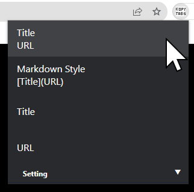
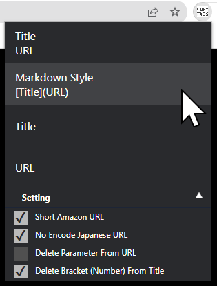

# Chrome Extention: Copy Tabs Title Url

## Screenshot

menu setting Collapse

menu setting Expand

## GitHub

standard-software/chrome-copy-tabs-title-url
https://github.com/standard-software/chrome-copy-tabs-title-url

## How to Install for developer

- git clone
  > git clone https://github.com/standard-software/chrome-copy-tabs-title-url.git

- chrome browser: open chrome extension page
- chrome browser: extension page: developer mode on
- chrome browser: extension page: Load unpackaged extensions.
- Specify the folder path
  .../chrome-copy-tabs-title-url/copy-tabs-title-url
- chrome browser: add extension icon copy-tabs-title-url

