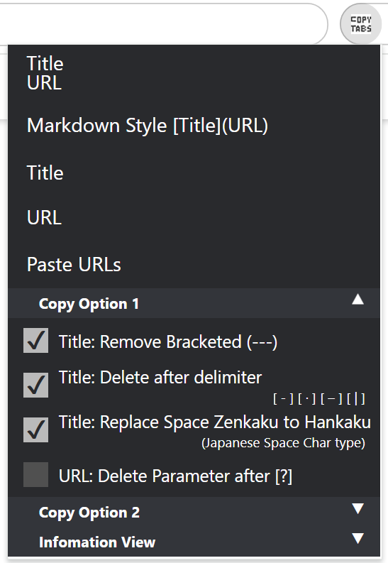
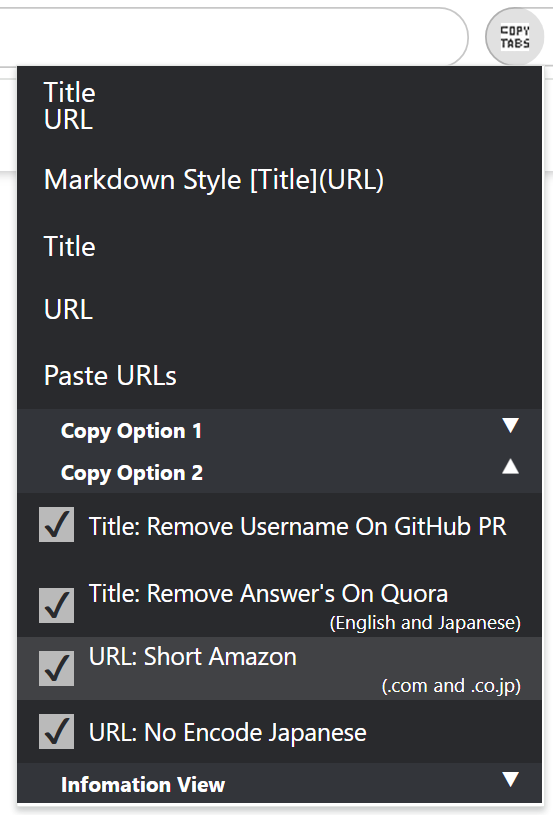

# Chrome Extention: Copy Tabs Title Url

## Chrome Web Store

Copy Tabs Title URL - Chrome Web Store  
https://chrome.google.com/webstore/detail/copy-tabs-title-url/lcfoefigmljgmbolbodknedngjcgelng

## GitHub

standard-software/chrome-copy-tabs-title-url  
https://github.com/standard-software/chrome-copy-tabs-title-url

## Screenshot

Copy Tabs Menu Items

Expand Copy View

Expand Select Option

Expand Setting

## Feature

Copy the title and URL from a Chrome tabs.

### Menu Item
- Title \n URL
- Markdown Style [Title](URL)
- Title
- URL
- Paste URLs and Open New Tabs

### Select Option
- URL: Delete Parameter after[?]
- Title: Remove Bracketed (---)
- Title: Replace Space Zenkaku to Hankaku (Japanese Space Char type)
- Title: Remove Answer's On Quora (English and Japanese)
- Title: Remove User Org On GitHub PR

### Setting
- URL: Short Amazon (.com and .co.jp)
- URL: No Encode Japanese
- URL: Blacket () -> %28 %29

## How to Install for developer

- git clone  
  \> git clone https://github.com/standard-software/chrome-copy-tabs-title-url.git

- chrome browser: open chrome extension page
- chrome browser: extension page: developer mode on
- chrome browser: extension page: Load unpackaged extensions.
- Specify the folder path
  .../chrome-copy-tabs-title-url/copy-tabs-title-url
- chrome browser: add extension icon copy-tabs-title-url

## Version

### 1.2.0β
2024/05/17 Fri
- Add Setting
  - URL: Blacket () -> %28 %29

### 1.1.0
2024/05/16 Thu
- Some of the items in setting were moved to select option.
- menu names to be more readable.
- Add function
  - Paste URLs and Open New Tabs

### 1.0.2
2022/04/15(Fri)
- return tabs permissions from manifest.json
  - Removing tab does not work.

### 1.0.1
2022/04/14(Thu)
- Remove tabs permissions from manifest.json

### 1.0.0
2022/04/09(Sat)
- Fix only amazon.co.jp >> only amazon.com & amazon.co.jp
- update Remove Bracketed (---) From Title
  - Only Remove First but Remove All
- Change wording Menu Item
- add Replace Space Zenkaku to Hankaku From Title(Japanese)
- Fix No Encode Japanese
  - include space remain %20

### 0.4.0
2022/04/06(Wed)
- Unselect text
- add feature
  - Remove UserName From Title On GitHub Pull Request

### 0.3.1
2022/04/02(Sat)
- Unselect text
- Change wording

### 0.3.0
2022/04/02(Sat)
- Quora (English and Japanse) Delete Answer Account Name From Title
- fix decode japanese url error

### 0.2.0
2022/03/15(Tue)
- Add Copy View

### 0.1.0
2022/03/09(Wed)
- First Release

