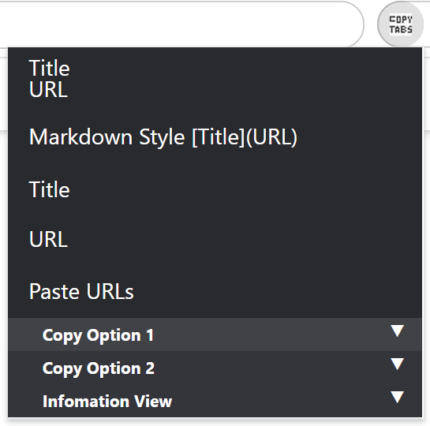

# Chrome Extention: Copy Tabs Title Url

## Screenshot

menu expand

menu collapse Copy View

menu collapse Setting

## GitHub

standard-software/chrome-copy-tabs-title-url
https://github.com/standard-software/chrome-copy-tabs-title-url

## How to Install for developer

- git clone
  > git clone https://github.com/standard-software/chrome-copy-tabs-title-url.git

- chrome browser: open chrome extension page
- chrome browser: extension page: developer mode on
- chrome browser: extension page: Load unpackaged extensions.
- Specify the folder path
  .../chrome-copy-tabs-title-url/copy-tabs-title-url
- chrome browser: add extension icon copy-tabs-title-url

## Version

### v0.2.0
2022/03/15(Tue)
- Add Copy View

### v0.1.0
2022/03/09(Wed)
- First Release

